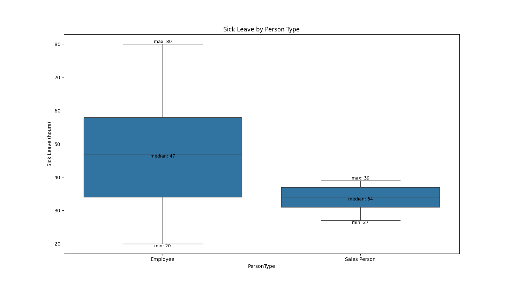

# Q4: What is the relationship between sick leave and Job Title?
##  Data Source

To address the question “What is the relationship between sick leave and Job Title (PersonType)”, data was extracted from the **AdventureWorks2022** database. The final dataset was constructed by joining relevant tables:
- **`[HumanResources].[Employee]`**
- **`[Person].[Person]`**
- **`[HumanResources].[vEmployeeDepartment]`**

As a result of this joint I received a table with attributes **JobTitle, PersonType, SickLeaveHours, Department** and **GroupName**

I exported the resulting table to a **CSV file** and loaded it into **Pandas DataFrame** for analysis.

## Analysis

Initial analysis showed that there are just two values for **PersonType** and 67 different values for **JobTitle**.  
To visualise the distribution of **SickLeaveHours** across the distinct **PersonType** categories I performed a **boxplot** analysis. 

First, the Employee category, on the left, shows a significantly higher median sick leave usage, sitting around 47 hours. And the overall range is very broad—from 20 hours all the way up to 80 hours. 

In contrast, the Sales Person group, on the right, has a much lower median of about 34 hours. Furthermore, their usage is less spread out, ranging only from 27 to 39 hours, 3-4 days.

The takeaway here is that Sales staff consistently take fewer sick leave hours than non sales employees. This trend could be influenced by commissions policies or high job pressure.

Due to the large number of unique job titles presented in the dataset, the relationship between JobTitle and SickLeaveHours was explored by focusing on the extremes: the top 10 and bottom 10 job titles ranked by average sick leave. This analysis was visualized using dual horizontal bar charts. 

And on these charts we can notice that (with the single exception of the Chief Executive Officer (69.0h)) the roles with the highest average leave are the operational and physical labor roles (e.g., Stocker, Janitor). On the right graph we can see that the list is dominated by technical and senior management roles, such as the Chief Financial Officer (20 hours), Vice President of Engineering and various Engineers.

**To summarise:** Our operational and physical labor roles are taking the most leave, likely due to physical strain, while our technical and senior management roles are taking the least. This low usage in sales persons/technical roles/senior management roles is a red flag for potential burnout risk. For the Sales team, we maybe need to review commission policies to ensure they don't penalise for taking time off. For our Senior and Technical roles, we may implement targeted wellness programs and training to prevent burnout and encourage necessary rest.

I also looked at sick leave averages across different departments, but that analysis didn't show any interesting or unexpected patterns. Since it wasn't the focus of our initial question, I decided to keep the presentation focused solely on the Person Type and Job Title insights.

