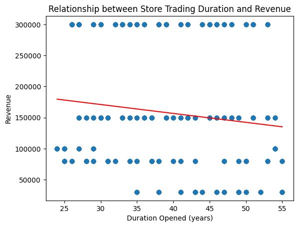
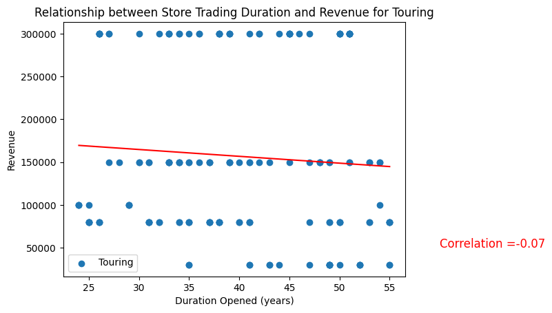
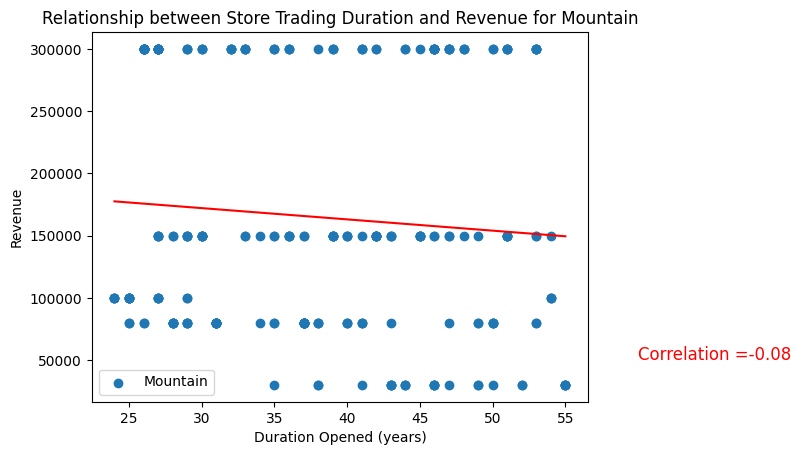
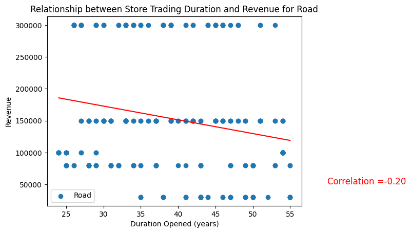
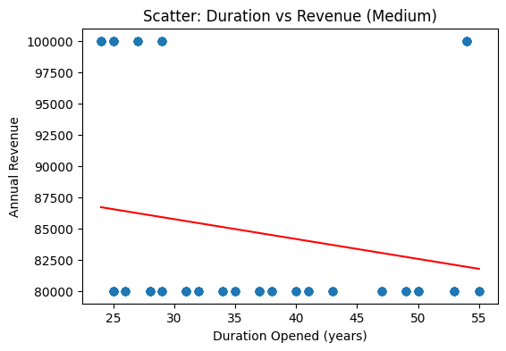
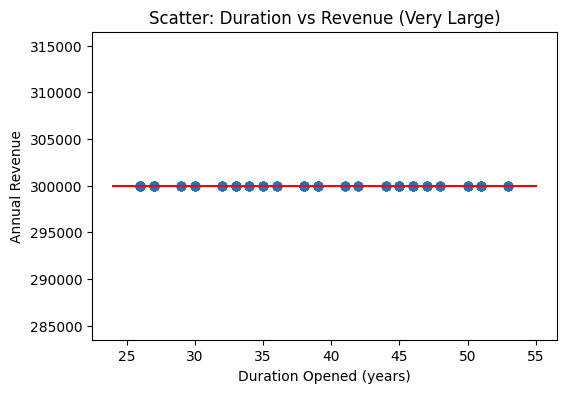
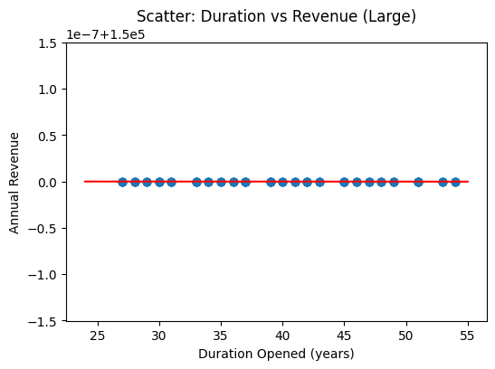
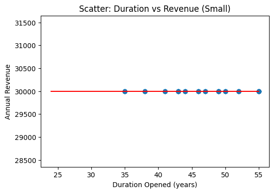

- Analyzed the relationship between **store age** and **revenue** using AdventureWorks2022 data.  

  

>**Note:** Overall correlation is very low (**-0.13**) → no clear relationship.  

- Grouping by **store specialty** (`Touring`, `Mountain`, `Road`) also shows no significant correlation.

  

  

  

- Grouping by **store size** (`Small`, `Medium`, `Large`, `Very Large`) also shows no significant correlation between store age and revenue. 

This creates four size categories:
- Small: 0–15,000 sq. ft.
- Medium: 15,001–30,000 sq. ft.
- Large: 30,001–50,000 sq. ft.
- Very Large: 50,001–80,000 sq. ft.

   
   
   
   

>**Note:** Many size categories have **constant revenue** due to synthetic data, so correlation cannot be calculated.  
### Check of Unique Values per Size Category

| Category    | Unique Duration Values | Unique Revenue Values |
|------------|-----------------------|---------------------|
| Very Large | 21                    | 1                   |
| Large      | 23                    | 1                   |
| Medium     | 21                    | 2                   |
| Small      | 11                    | 1                   |

## **Conclusion:** Store age does not meaningfully affect revenue in this dataset.
