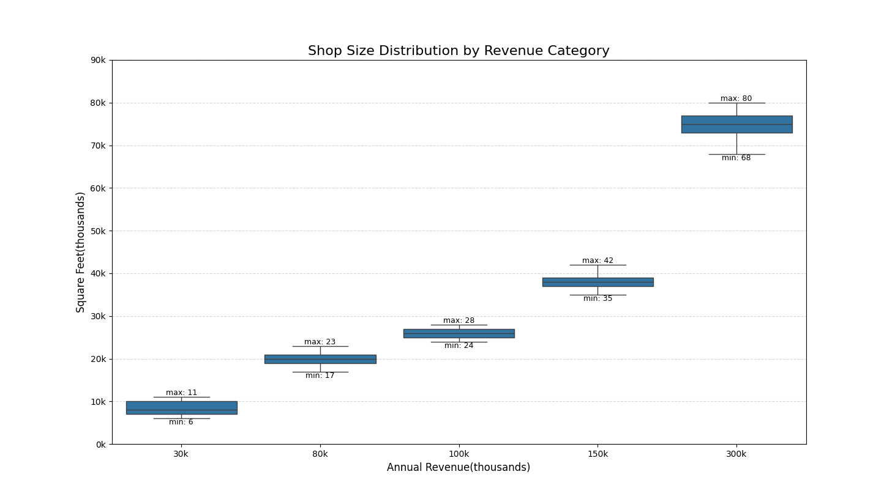
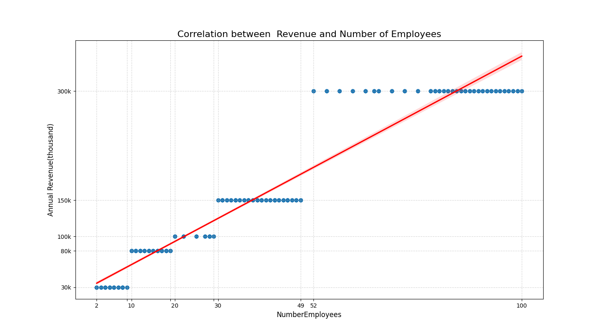
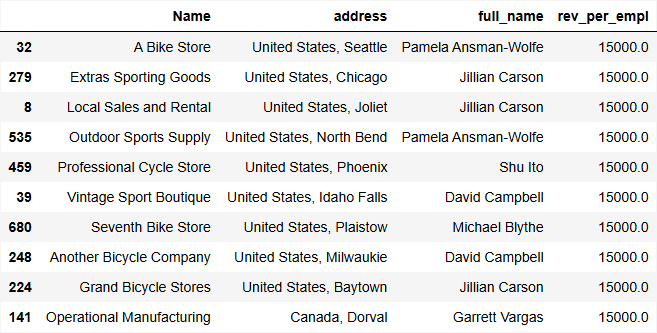
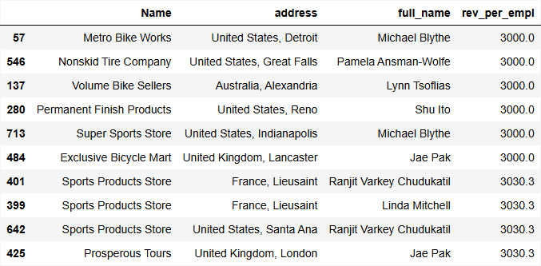

# Q4: What is the relationship between the size of the stores, number of employees, and revenue?

##  Data Source

To address the question “What is the relationship between the size of the stores, number of employees, and revenue?”, data was extracted from the view **Sales.vStoreWithDemographics**. This view provides all the necessary attributes: **Name, AnnualRevenue, SquareFeet**, and **NumberEmployees**, allowing to complete analysis of store performance.

I exported the resulting table to a **CSV file** and loaded it into **Pandas DataFrame** for analysis.

## Analysis 

it's important to note a peculiarity in our data: revenue is not recorded as a continuous  figure but is categorised into five distinct buckets (30K, 80K, 100K, etc.). This makes the graphics look a little unusual, but it still allows us to see the overall trend.

The initial analysis involved exploring the correlations between store size (SquareFeet), number of employees, and revenue using plots generated with Python libraries Seaborn and Matplotlib. 

These visualisations confirmed the expected trend: larger stores with more employees tend to generate higher revenue.

However, this insight alone was not very meaningful, since larger stores naturally earn more. To measure efficiency or performance fairly, I created more informative metric:

**RevenuePerEmployee = AnnualRevenue / NumberEmployees**

When we plot Revenue Per Employee against Shop Size (shown in the scatter plot), we observe a slight negative correlation. This is our core insight: While large stores generate higher absolute revenue, our smaller shops are actually slightly more efficient on a per-employee basis. We can use this insight to re-evaluate how we allocate our staff and manage space.

Using this new efficiency metric, we can focus on specific stores that deserve our attention. The tables show our Top 10 Most Efficient and Least Efficient stores.

 
 To better understand where the best and worst stores are located and who manages them, I decided to include additional information (location and manager) and created new table by joining:

- **Sales.Store**
- **Sales.vStoreWithAddresses**
- **Person.Person**

This combined data provided store name, location and sales representative details, which can help identify geographical patterns and personnel responsible for the best- and worst-performing stores. We can analyse what the best performers are doing differently compared to the bottom performers and  then use these to create new best-practice training and improve overall sales performance across the company