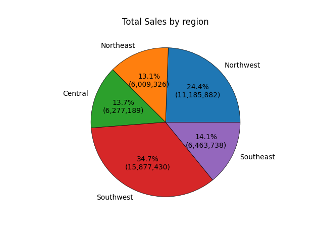
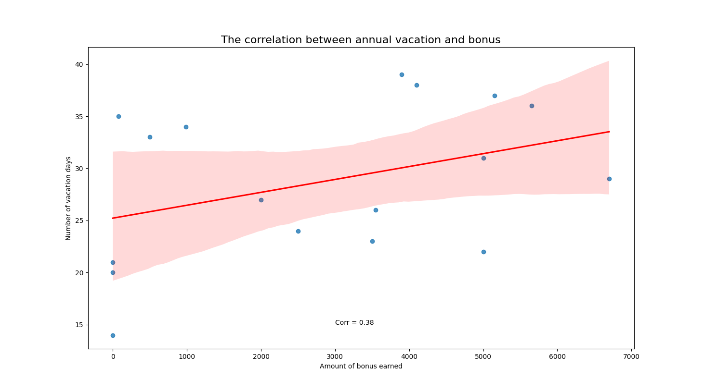
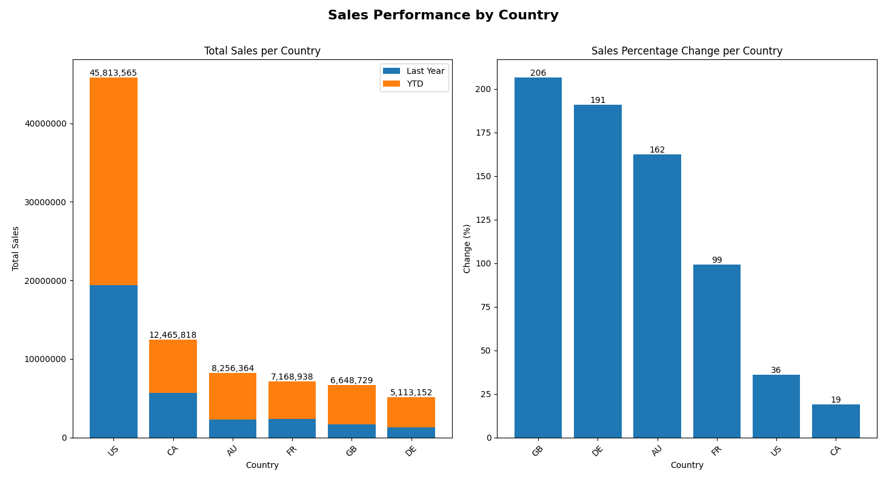
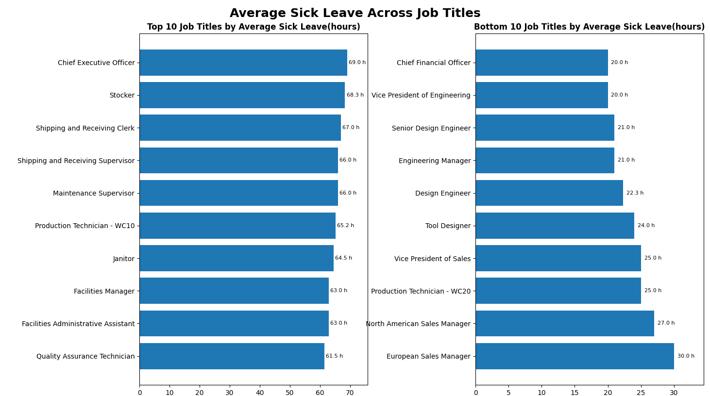
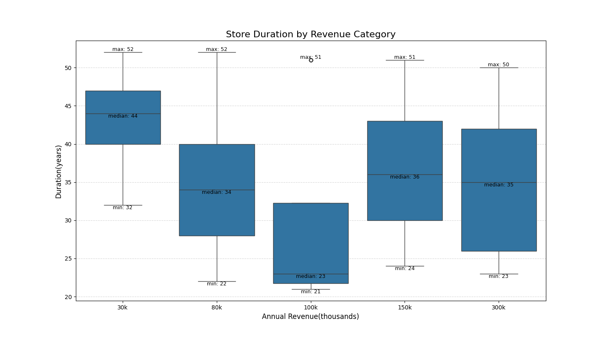
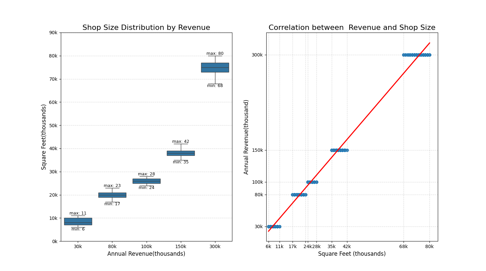
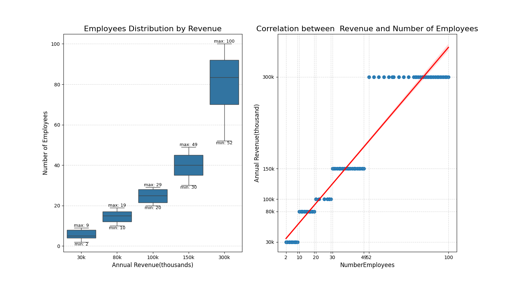
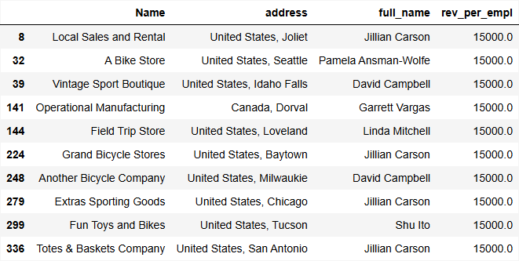
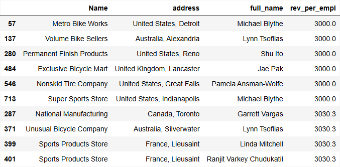

# AdventureWorks Data Analysis Project

## Project Overview

This project was a group interim project completed during my **Generation Data Bootcamp** and represents a full-cycle data analytics workflow using the **AdventureWorks database** provided by Microsoft. The project involved extracting and aggregating data from a relational database using **SQL**, performing data analysis and visualisation in **Python** (using **pandas, matplotlib**, and **seaborn**), and interpreting results to generate actionable business insights. The final findings were compiled into a presentation and delivered to peers, with a focus on clear communication of trends and data-driven recommendations.

---

## Task Description
Using the **AdventureWorks database**, the objective of this project is to investigate the dataset and answer the following questions:

1. What are the regional sales in the best-performing country?
2. What is the relationship between annual leave taken and bonus?
3. What is the relationship between country and revenue?
4. What is the relationship between sick leave and job title (PersonType)?
5. What is the relationship between store trading duration and revenue?
6. What is the relationship between store size, number of employees, and revenue?

The results should be supported by visualisations and business-oriented interpretations suitable for stakeholder communication.

---

## Database Description
AdventureWorks is a **sample relational database created by Microsoft** that represents a fictional manufacturing and retail company selling bicycles and related products. It is commonly used for learning and practicing **SQL, data modeling, and data analysis**.

The database is organised into multiple schemas representing different business domains, including:
- **Sales** – customer data, sales orders, territories, and revenue
- **Production** – products, categories, inventory, and manufacturing data
- **HumanResources** – employees, job titles, departments, and leave information
- **Purchasing** – vendors and procurement data
- **Person** – people and contact information

---

## Analysis and Answers

### Question 1: Regional Sales in the Best-Performing Country

To identify the top-performing country, data was queried from the **`Sales.SalesTerritory`** table, using the attributes **CountryRegionCode**, **SalesYTD**, and **SalesLastYear**. After determining that the **United States** had the highest total sales, data for its individual regions was extracted from the same table. Finally, **matplotlib.pyplot** was used to create pie charts illustrating the total sales distribution by region.

According to the piechart, the **South West** region has generated the highest sales. To sustain growth, it would be beneficial to analyse the strategies driving the **South West** region’s success and consider applying similar approaches to underperforming regions.

---

### Question 2: Relationship Between Annual Leave Taken and Bonus

To analyse the relationship between annual leave and bonuses, data on **Bonus** and **VacationHours** was retrieved by joining the **`Sales.SalesPerson`** and **`HumanResources.Employee`** tables on **BusinessEntityID**. Using pandas, the correlation between vacation taken and bonus was calculated, and then was created a scatter plot to visualise the relationship.

There is a **weak positive correlation (≈0.38)** between vacation and bonus. On average, higher bonuses tend to be associated with more vacation, but the relationship is inconsistent. The scatter plot shows points are widely spread, for similar bonus amounts, vacation hours vary a lot. Some employees with low bonuses still have relatively high vacation hours, and vice versa. This suggests that bonuses might be influenced by other factors, such as role, performance, or tenure. Note: correlation does not imply causation, vacation hours do not cause higher bonuses, both may be influenced by a third factor (e.g. seniority or job title).

---

### Question 3: Relationship Between Country and Revenue

To analyse the relationship between **Country** and **Revenue**, data was aggregated from the **`Sales.SalesTerritory`** table using SQL. Total revenue was calculated for each country, along with the percentage change between the current year (**SalesYTD**) and the previous year (**SalesLastYear**). In Python, two bar charts were created: one showing **total revenue by country** and another illustrating **the percentage change in revenue for each country**.

The **USA** leads with nearly **$45M**, followed by **Canada** at **$12M**, but both show moderate growth (**36%** and **20%**). In contrast, **GB (206%)**, **Germany (190%)**, and **Australia (162%)** are growing rapidly. 
While it is important to maintain strong sales strategies in the USA and Canada to protect market share, high-growth countries such as GB, Germany, and Austria offer significant expansion potential. Investigating the drivers of growth in these regions and increasing marketing, investment, or staffing could help capture this momentum.

---

### Question 4: Relationship Between Sick Leave and Job Title (PersonType)

To address this question, data was extracted from the **AdventureWorks2022** database. The final dataset was constructed by joining relevant tables: **`HumanResources.Employee`**, **`Person.Person`**, **`HumanResources.vEmployeeDepartment`**. As a result of this joint I received a table with attributes **JobTitle, PersonType, SickLeaveHours, Department** and **GroupName**. Resulting table was exported to a **CSV file** and loaded into **Pandas DataFrame** for analysis. Initial analysis showed that there are just two values for **PersonType** and 67 different values for **JobTitle**.  
To visualise the distribution of **SickLeaveHours** across the distinct **PersonType** was used a **boxplot**. 

First, the Employee category, on the left, shows a significantly higher median sick leave usage, sitting around 47 hours. And the overall range is very broad—from 20 hours all the way up to 80 hours. In contrast, the Sales Person group, on the right, has a much lower median of about 34 hours. Furthermore, their usage is less spread out, ranging only from 27 to 39 hours, 3-4 days.The takeaway here is that Sales staff consistently take fewer sick leave hours than non sales employees. This trend could be influenced by commissions policies or high job pressure.

Due to the large number of unique job titles presented in the dataset, the relationship between JobTitle and SickLeaveHours was explored by focusing on the extremes: the top 10 and bottom 10 job titles ranked by average sick leave. This analysis was visualised using dual horizontal bar charts. 

On these charts we can notice that (with the single exception of the Chief Executive Officer (69.0h)) the roles with the highest average leave are the operational and physical labor roles (e.g., Stocker, Janitor). On the right graph we can see that the list is dominated by technical and senior management roles, such as the Chief Financial Officer (20 hours), Vice President of Engineering and various Engineers.

**To summarise:** Operational and physical labor roles are taking the most leave, likely due to physical strain, while technical and senior management roles are taking the least. This low usage in sales persons/technical roles/senior management roles is a red flag for potential burnout risk. For the Sales team, commission policies should be reviewed to ensure they don't penalise for taking time off. For Senior and Technical roles, targeted wellness programs and training might be implemented to prevent burnout and encourage necessary rest.

---

### Question 5: Relationship Between Store Trading Duration and Revenue

The information needed to answer this question — **Revenue** and **YearOpened** — existed in the view **`Sales.vStoreWithDemographics`**.

**Correlation coefficient** between **Revenue** and **YearOpened** equals **-0.1336**, which indicates that there is **no meaningful relationship** between store trading duration and revenue. 
To visualise the relationship between **Duration Opened** and **AnnualRevenue** was used a boxplot

The analysis shows no strong linear relationship between store trading duration and revenue; older stores are not consistently higher-revenue, and some younger stores perform exceptionally well. This indicates that revenue growth probably depends on other factors such as store size, staffing levels and location.

---

### Question 6: Relationship Between Store Size, Number of Employees, and Revenue

To address this question data was extracted from the view **`Sales.vStoreWithDemographics`**. This view provides all the necessary attributes: **Name, AnnualRevenue, SquareFeet**, and **NumberEmployees**, allowing to complete analysis of store performance. 

it's important to note a peculiarity in our data: revenue is not recorded as a continuous figure but is categorised into five distinct buckets (30K, 80K, 100K, etc.). This makes the graphics look a little unusual, but it still allows to see the overall trend.

The initial analysis involved exploring the correlations between store size (SquareFeet), number of employees, and revenue using plots generated with Python libraries Seaborn and Matplotlib. 

These visualisations confirmed the expected trend: larger stores with more employees tend to generate higher revenue. However, this insight alone was not very meaningful, since larger stores naturally earn more. To measure efficiency or performance fairly was created more informative metric:

**RevenuePerEmployee = AnnualRevenue / NumberEmployees**

This scaterplot shows slight negative correlation. While large stores generate higher absolute revenue, smaller shops are actually slightly more efficient on a per-employee basis. This insight can be used to re-evaluate allocation of the staff and space management.

Using this new efficiency metric, we can focus on specific stores that deserve our attention. The tables show Top 10 Most Efficient and Least Efficient stores.

### Most Efficient Stores

### Least Efficient Stores

 To better understand where the best and worst stores are located and who manages them, we need additional information (location and manager). For this purpose was created new table by joining **`Sales.Store`**, **`Sales.vStoreWithAddresses`** and **`Person.Person`**.

This combined data provided store name, location and sales representative details, which can help identify geographical patterns and personnel responsible for the best- and worst-performing stores. We can analyse what the best performers are doing differently compared to the bottom performers and then use these to create new best-practice training and improve overall sales performance across the company

---

## Tools and Technologies
- SQL
- Python (Pandas, Matplotlib, Seaborn)
- Excel 
- GitHub for version control and collaboration

---

